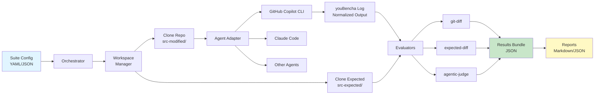
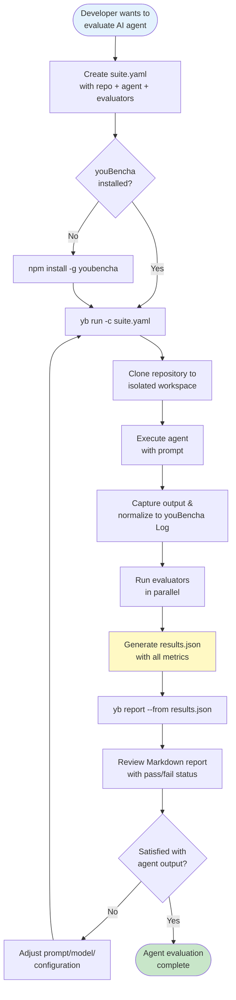
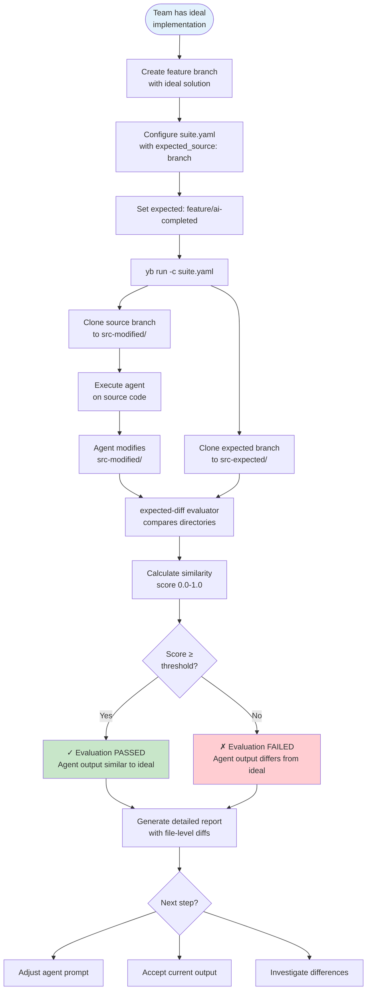
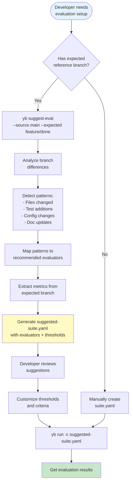
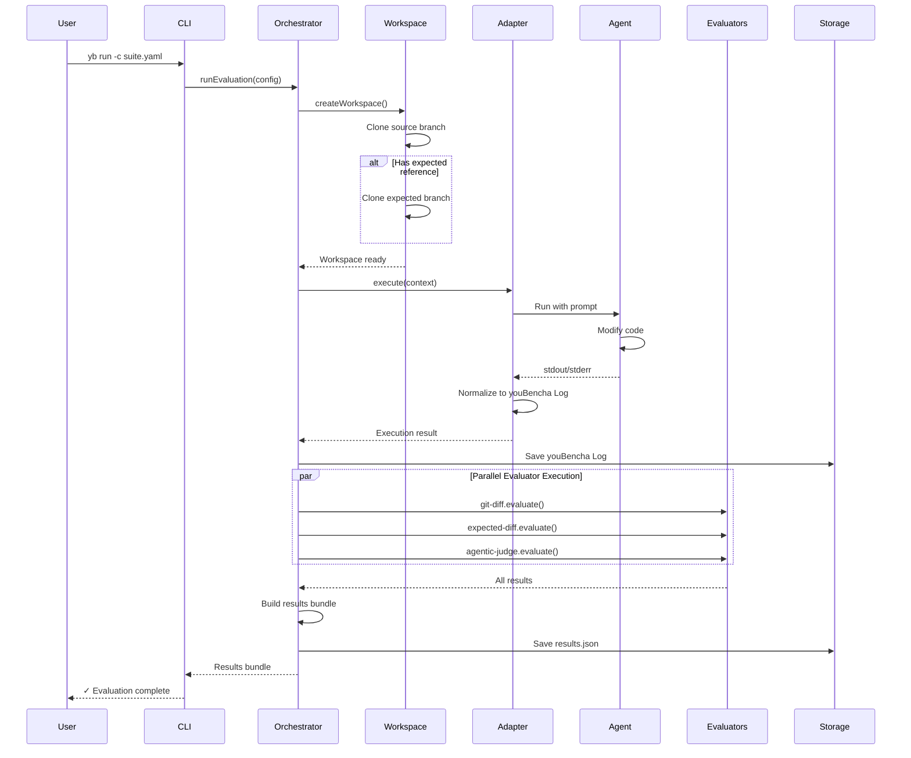
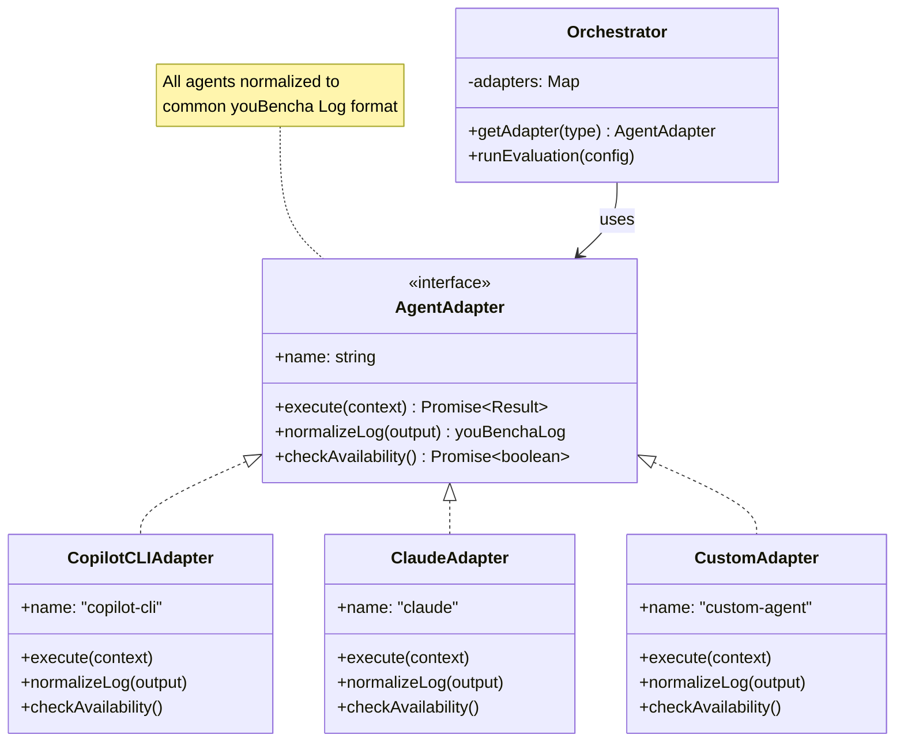
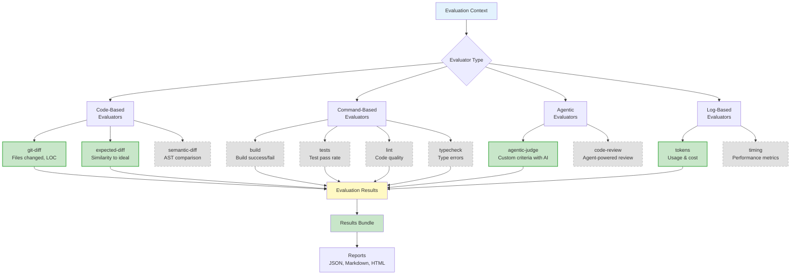
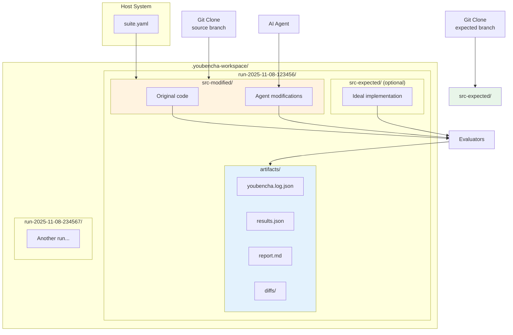

## Mermaid Diagrams

### Architecture Overview

### User Flow: Basic Evaluation

### User Flow: Expected Reference Comparison

### User Flow: Evaluator Suggestion

### Execution Model: Orchestrator Flow

### Concept: Agent Adapter Pattern

### Concept: Evaluator Ecosystem

### Concept: Workspace Isolation

### Use Case: Prompt Engineering Iteration

```mermaid
flowchart LR
    V1[Prompt v1:<br/>'Add tests'] --> Run1[yb run -c v1.yaml]
    Run1 --> R1[Score: 65%<br/>Coverage: 45%]
    R1 --> Analyze1[Low coverage,<br/>missing edge cases]
    Analyze1 --> V2[Prompt v2:<br/>'Add comprehensive tests<br/>including edge cases']
    
    V2 --> Run2[yb run -c v2.yaml]
    Run2 --> R2[Score: 82%<br/>Coverage: 78%]
    R2 --> Analyze2[Better, but<br/>missing error tests]
    Analyze2 --> V3[Prompt v3:<br/>'Add tests with edge cases,<br/>error handling, and<br/>boundary conditions']
    
    V3 --> Run3[yb run -c v3.yaml]
    Run3 --> R3[Score: 94%<br/>Coverage: 91%]
    R3 --> Success[✓ Meets criteria<br/>Deploy prompt]
    
    style V1 fill:#ffcdd2
    style V2 fill:#fff9c4
    style V3 fill:#c8e6c9
    style Success fill:#a5d6a7
```

### Timeline: Evaluation Run

```mermaid
gantt
    title youBencha Evaluation Timeline
    dateFormat ss
    axisFormat %Ss
    
    section Setup
    Parse config           :a1, 00, 1s
    Create workspace       :a2, after a1, 2s
    Clone source repo      :a3, after a2, 5s
    Clone expected repo    :a4, after a2, 5s
    
    section Agent
    Execute agent          :b1, after a3, 12s
    Normalize logs         :b2, after b1, 1s
    Save youBencha log     :b3, after b2, 1s
    
    section Evaluators
    git-diff               :c1, after b3, 2s
    expected-diff          :c2, after b3, 3s
    agentic-judge          :c3, after b3, 8s
    
    section Results
    Aggregate results      :d1, after c3, 1s
    Save results bundle    :d2, after d1, 1s
    Generate report        :d3, after d2, 2s
```

